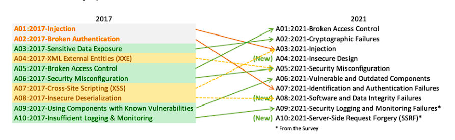

# INTRODUCTION TO BUG BOUNTY 

**ROLE AS A BUG HUNTER**

1] security Reasearcher
2] Penteration tester
3] Security consultant
4] Security engineer
5] Security analyst
6] Incident reporter/responder
7] Cyber threat hunter

**BUG BOUNTY PLATFORM**

1] Open bug bounty
2] Hackerone
3] Intigriti
4] Yes we hack
5] Bug crowd

**OWASP CHECKLIST**
[github](https://github.com/0xRadi/OWASP-Web-Checklist)

**OWASP TOP 10**

